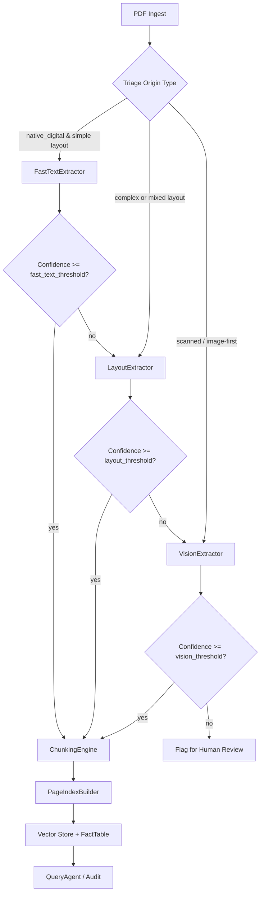

# Refinery Pipeline – Domain Notes

## Extraction Decision Tree


## Confidence Thresholds (default)
- `fast_text`: 0.70  
- `layout`: 0.70  
- `vision`: 0.70  
- Any page below threshold escalates to the next strategy; if final strategy stays low, page is flagged for review.

## Observed Failure Modes
- **Scanned low-contrast pages**: OCR/VLM may return sparse text; expect escalation and review flags.
- **Multi-column + heavy tables**: Layout extractor may mis-order cells; chunk validator prevents header/row splits.
- **Non-Latin scripts mixed with symbols**: Vision extractor can succeed, but token cost may spike; monitor CostTracker caps.
- **Corrupted PDFs or oversized pages**: pdfplumber may fail page rendering; router will log but page needs manual handling.
- **Figure-only pages**: Low text density triggers vision path; ensure captions captured or mark for review.

## Pipeline Architecture (bird’s-eye)
```mermaid
flowchart LR
    ingest[Ingest] --> triage[Triage Agent]
    triage --> router[Extraction Router]
    router -->|FastText/Layout/Vision| extraction[ExtractedDocument]
    extraction --> chunker[Chunking Engine]
    chunker --> indexer[PageIndex Builder]
    chunker --> vectors[Vector Store]
    chunker --> facts[FactTable (SQLite)]
    indexer --> query[Query Agent]
    vectors --> query
    facts --> query
    query --> audit[Audit Mode / Provenance]
```
